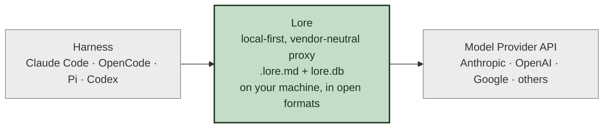

In April, Harrison Chase wrote an essay called
[Your harness, your memory](https://blog.langchain.com/your-harness-your-memory/).
He named what the AI tooling industry has been circling for a year.
Memory is the new lock-in. The harness owns it by default, and the
harness is what every platform is racing to be.

He was right about the diagnosis. He was not entirely accurate with
the prescription. He builds LangChain, so he is primed to think in
terms of harness-first. Broaden your thinking and there is a better,
more independent way, and Lore is the proof.

> "There is sometimes sentiment that memory is a standalone service,
> separate from any particular harness. At this point in time, that
> is not true."
> — Harrison Chase, [Your harness, your memory](https://blog.langchain.com/your-harness-your-memory/)

The analogy is wrong on the merits too. Memory is part of your brain.
Agent harnesses are like your body, the limbs and everything. You
don't move your memory to your limbs. You move your memory to your
brain.

Our argument is equally self-serving as LangChain's. The difference
is: you can move away from Lore and keep your organized SQLite
database to yourself. That is true open memory.

The time has come. Lore is the standalone memory service, and it is
the architecture that gets you out of the trap.

## The platform owns your data. You should.

When a closed platform builds "agent memory," it stores your team's
decisions in a proprietary database behind an API. Retrieval shapes
the agent, and the shape of the agent is the shape of the moat.
Switch IDEs, switch models, switch anything, and the team rebuilds
months of context from scratch. The lock-in is the product.

Harrison names three levels. The mild one stores state on the
provider's server so you cannot move threads between models. The bad
one runs a closed harness that interacts with memory in ways you
cannot see, and the artifacts are not portable. The worst one puts
everything behind an API, including long-term memory, and you own
none of it. Anthropic's Claude Managed Agents already lives in the
second camp; Codex builds an encrypted compaction summary nothing
outside OpenAI can read. The incentive is everywhere, and it points
the same way.

Six months of careful work, six months of capturing a team's taste,
and a vendor change returns the team to zero.

## Lore is local-first and we want to keep it that way

Lore is a vendor-neutral proxy that sits between your harness and
your model. The whole engine runs on your machine. The memory lives
in your repo and your local database, in open formats you can read
with or without Lore.



*The LLM is the cognition, Lore is the memory layer. They form the brain. The harness is the body, the actuator.*

What you actually own is two things:

- **`.lore.md`** at the root of your repo. The curated knowledge the
  team has reviewed and merged. Version-controlled, PR-reviewable,
  human-readable Markdown.
- **A local SQLite database** at `~/.local/share/lore/lore.db`. The
  full record: raw conversations, distillations, long-term memory,
  entities. Open schema, queryable with `sqlite3`, exportable.

The engine that ties them together is fair source
(FSL-1.1-Apache-2.0). The code that touches your tokens is right
there to read, and it turns into Apache 2.0 on a timer.

The SQLite file is the vector database. The vectors ride alongside
the temporal messages, the distillations, and the long-term memory
entries, in one open file. No separate vector store, no separate
process, no separate bill. When a team changes a memory entry, the
engine picks up the change on the next session and re-embeds the
affected entries. Fast and transparent, on your hardware.

## The vendor route vs the local-first route

Harrison is right. You shouldn't put your memory into a vendor's hands.
The lock-in is real, and the way to escape it is to keep the data
on your machine, in open formats you can read with `sqlite3` and
edit with any text editor. To change a memory entry, you edit the
file. To delete an entry, you delete the row. To export the corpus,
you run `sqlite3 lore.db .dump`. To move to a different vendor, you
point the new tool at the same files.

The same logic applies to the harness. You wouldn't lock yourself
into a single LLM provider, and you shouldn't lock yourself into a
single harness either. Claude Code today, Pi tomorrow, Codex next
quarter, something new next year. The memory should outlast the
harness. The harness is the part you swap; the artifact is the part
that stays.

When your team is ready to share, the sync engine works the way a
good group chat does: end-to-end encrypted, scoped to the entries
you explicitly approve, and the relay never sees plaintext. The
keys stay with the participants. Sharing is opt-in, per entry, and
reversible.

## Why this matters

We have talked before about
[why knowledge lives in token space, not in weights](/blog/distill-your-own-knowledge/).
The same logic applies to where the token-space lives. A database in
someone else's cloud is halfway there. A database or engine tied to
your harness might be better. A replaceable middle layer for memory,
all data local and owned by you, is the rest of the way.

Models will keep changing. They always do. Every part of the AI
tooling stack above the model is genuinely up for grabs right now.
The part that should not be up for grabs is who owns your team's
data. That belongs to the team, on infrastructure the team controls.

Lore is local-first. We aim to keep it that way.

## Try it

```bash
curl -fsSL https://withlore.ai/install | bash
lore run
```

After a few sessions, open `.lore.md` and the database at
`~/.local/share/lore/lore.db`. Read what your agent has written
down. Open a PR when it gets something wrong. That is the workflow.
